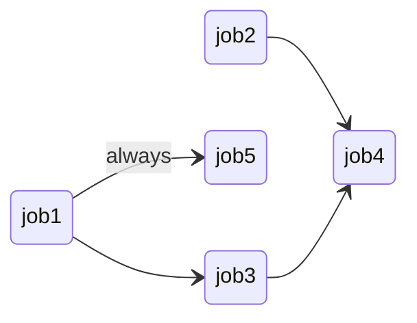
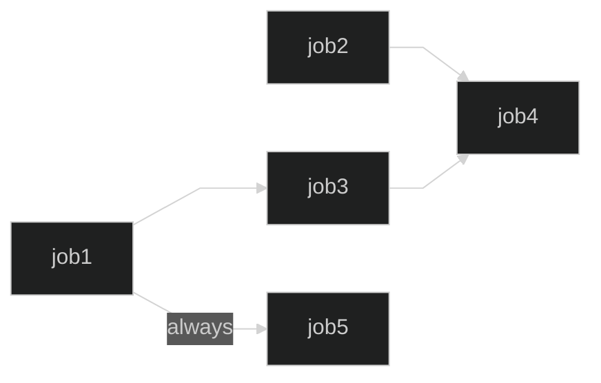

```mermaid
stateDiagram
direction LR
job1 --> job3
job1 --> job5: always
job2 --> job4
job3 --> job4
```

```mermaid
%%{init: {'theme':'dark', 'flowchart': {"curve":"linear"} } }%%
graph LR
A[job1] --> B[job3]
C[job2] --> D[job4]
B[job3] --> D[job4]
A[job1] --> |always| E[job5]
```
